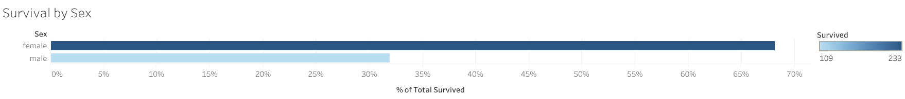
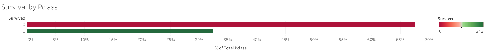
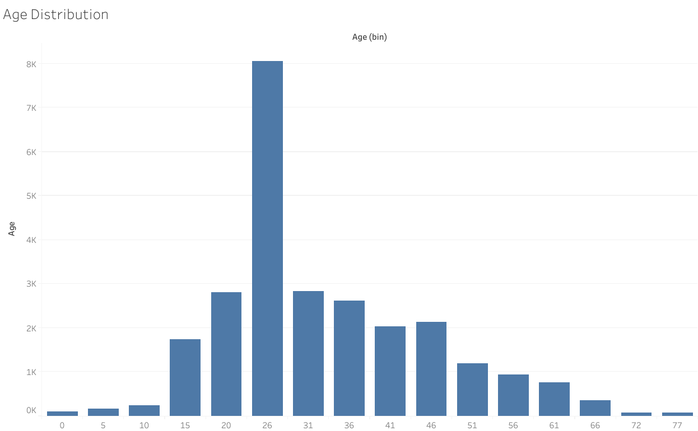

# Created Charts
##Below are the charts I created using Tableau Public:

### Survival Rate by Gender

### Survival by Ticket Class

### Age Distribution

Interactive dashboard link: [Tableau Public](<https://public.tableau.com/app/profile/chung.vong/viz/chartstitanic/SurvivalbyPclass>)

## Git commands I used
(Recorded in the file `GIT_DEMO.md`)
